# 訂餐外送系統

## 一、系統概述

一個線上訂餐平台，提供消費者線上訂餐、餐廳管理餐單與訂單，以及外送員接單與配送的完整平台，目標提升點餐便利性、餐廳營運效率與送餐透明度。

## 二、Requirement engineering

### 1. 使用者需求（User requirements）

- **UR-01.** 顧客應能在系統上以關鍵字或地點搜尋附近餐廳並瀏覽菜單。
- **UR-02.** 顧客應能將多項餐點加入購物車並下達訂單。
- **UR-03.** 顧客應能使用信用卡、第三方支付或線上錢包付款。
- **UR-04.** 顧客應能即時查看訂單狀態（已接單、外送員取餐、運送中、已完成）。
- **UR-05.** 顧客在訂單發生問題時，能透過客服聯繫並申請退款或補償。
- **UR-06.** 餐廳應能登入平台並管理菜單、接單/拒單、更新備餐狀態。
- **UR-07.** 外送員應能接收派單、查看取餐/送餐位置並回報完成狀態。
- **UR-08.** 平台管理者應能產生營運報表（交易量、熱門餐點、使用者留存）。
- **UR-09.** 系統應支援尖峰流量並在高負載下維持關鍵功能可用。

### 2. 系統需求（System requirements）

#### SR-01. 搜尋與瀏覽

- 系統提供以地理位置與關鍵字搜尋餐廳的功能。
- 系統在搜尋結果中顯示餐廳評分、營業時間與外送時段。

#### SR-02. 購物車與下單

- 系統允許顧客建立購物車並在結帳時確認訂單明細（包含餐點、數量、備註、金額明細）。
- 系統在顧客下單後 5 秒內回傳訂單確認頁面（若成功送出），或顯示錯誤資訊。

#### SR-03. 付款

- 系統支援至少三種付款方式（信用卡、Apple/Google Pay、第三方支付），並以 PCI-DSS 或當地法規要求處理金流。
- 付款成功後系統產生交易紀錄並通知餐廳與外送員（若派單成立）。

#### SR-04. 訂單管理與追蹤

- 系統提供訂單狀態機制（狀態包括：已下單、餐廳接單、備餐中、已出餐、外送中、已完成、已取消、退款中）。
- 系統提供即時位置更新（外送員 GPS）與估計到達時間（ETA）。

#### SR-05. 餐廳管理

- 系統為餐廳提供菜單 CRUD（建立/讀取/更新/刪除）功能與每日營業設定。
- 系統提供餐廳接單介面並在餐廳確認後將狀態通知顧客與外送員。

#### SR-06. 外送員功能

- 系統讓外送員登入並接收/拒絕派單、導航至取餐地點、上傳送達照片/簽名（視業務需求）。
- 系統記錄外送員的工作時長、完成訂單數與評分。

#### SR-07. 客服與後台管理

- 系統提供客服介面查詢訂單明細、退款處理流程及追蹤歷史。
- 系統提供平台管理者產生營運報表（CSV / Dashboard）。

#### SR-08. 安全與遵守法律規範

- 系統加密儲存敏感資料（例如用戶個資、支付資訊），並遵循當地個資法與金流法規。
- 系統提供稽核日誌（audit log），記錄關鍵操作（退款、帳號修改、權限變更）。

### 3. 功能性需求（Functional Requirements）

#### I. 顧客功能（Customer Functions）

- **FR-01. 登入／註冊**：系統提供顧客帳號註冊與登入功能，支援電子郵件、手機號碼與密碼登入，並提供社群登入（Google、Facebook、Apple ID）。同時具備「忘記密碼」功能，透過 Email 或 SMS OTP 驗證重設。
- **FR-02. 餐廳瀏覽與搜尋**：顧客可依地點、類別、評分、外送時間與價格等條件搜尋餐廳，並可瀏覽餐廳詳細資訊（營業時間、外送門檻、預估外送時間、菜單項目）。
- **FR-03. 購物車與下單**：顧客可將餐點加入購物車，調整數量或移除項目，選擇配送或自取方式，並於結帳時填寫聯絡電話與地址。
- **FR-04. 線上付款**：系統整合第三方支付（信用卡、行動支付、電子錢包、貨到付款等）。每筆付款需產生交易記錄並回報成功或失敗。
- **FR-05. 訂單追蹤**：顧客可即時查看訂單狀態（備餐中、外送中、已完成），並追蹤外送員位置。系統在關鍵階段發送通知（App 推播／簡訊／Email）。
- **FR-06. 訂單管理**：顧客可查詢歷史訂單、再次下單或取消訂單（在可取消時間內）。
- **FR-07. 評價與回饋**：顧客可對餐廳與外送員進行星級與文字評價，餐廳可回覆評價。
- **FR-08. 優惠券使用**：顧客可於結帳時輸入優惠代碼或選擇折扣券使用。系統自動計算折扣後金額。

#### II. 餐廳功能（Restaurant Functions）

- **FR-09. 餐廳帳號管理**：餐廳可註冊店家帳號，設定營業時段與外送範圍。支援登入／登出／修改密碼功能。
- **FR-10. 菜單管理**：餐廳可新增、修改、刪除餐點項目，設定價格、圖片與庫存狀態。
- **FR-11. 訂單處理**：餐廳可查看新訂單、接受／拒絕訂單、更新訂單狀態（接單中、備餐中、完成），並即時通知顧客與外送員。
- **FR-12. 營收與報表**：餐廳可查閱每日、每週或自訂期間的營收統計與訂單數據報表。
- **FR-13. 優惠活動設定**：餐廳可參與平台促銷或自行設定折扣方案，並控制使用條件與期限。

#### III. 外送員功能（Delivery Partner Functions）

- **FR-14. 登入與狀態切換**：外送員可登入系統，設定「上線／下線」狀態以接單或休息。
- **FR-15. 派單接收與確認**：系統可自動或人工派單，外送員能接單或拒單；拒單後會自動重新分配。
- **FR-16. 外送導航與更新**：外送員可使用內建或整合地圖導航功能，更新配送狀態（出發取餐、取餐完成、配送中、已送達）。
- **FR-17. 外送證明上傳**：外送完成後，外送員需上傳送達照片或電子簽收紀錄。
- **FR-18. 收益與統計**：外送員可查看每日收益、工時、評價與接單數據報表。

#### IV. 管理者功能（Administrator Functions）

- **FR-19. 帳號與權限管理**：系統提供 RBAC（角色基礎存取控制），管理顧客、餐廳、外送員、客服與平台管理者等不同權限層級。
- **FR-20. 優惠與促銷管理**：管理者可建立、修改、刪除平台級優惠券或促銷活動，並設定適用條件與期間。
- **FR-21. 金流與退款審核**：管理者可審核退款請求，檢視交易紀錄與帳務報表，確保交易合法性與正確性。
- **FR-22. 系統監控與日誌**：系統需記錄訂單歷史、錯誤日誌與系統事件，管理者可查詢與匯出報表（訂單量、營收、外送效率）。
- **FR-23. 客服支援與糾紛處理**：提供客服工單系統，能查詢訂單、協助退款與調解糾紛。管理者可查看所有回報紀錄。

### 4. 非功能性需求（Non-Functional Requirements）

#### NFR-01 效能與速度（Performance & Speed）

| 需求類別 | 非功能性需求 | 影響對象 |
|---|---|---|
| 響應時間 | 95% 的訂單建立、支付或查詢操作必須在 3 秒內完成。 | 顧客體驗、系統流程順暢度 |
| 尖峰負載 | 系統必須能在用餐高峰期（如中午 12:00-13:00）處理每秒 1,000 筆交易，且不影響響應時間。 | 平台營運穩定性、防止系統崩潰 |
| 即時性 | 外送員的定位資訊必須以每 5 秒更新一次的速度傳輸給顧客。 | 顧客追蹤體驗、外送員管理效率 |

#### NFR-02 可用性與可靠性（Availability & Reliability）

| 需求類別 | 非功能性需求 | 影響對象 |
|---|---|---|
| 系統可用性 | 系統整體運行時間需達到 99.99%（即每年停機時間少於 52 分鐘），特別是在主要服務時段。 | 平台盈利、顧客信任 |
| 災難恢復 | 若主伺服器發生故障，系統須於 2 小時內恢復全面運作，資料損失不得超過 5 分鐘（RPO ≤ 5m）。 | 數據安全、業務連續性 |
| 容錯能力 | 當單一餐廳接單設備故障時，訂單資訊必須能自動轉發至備援設備或營運後台。 | 餐廳營運穩定、訂單準確性 |

#### NFR-03 安全性與隱私性（Security & Privacy）

| 需求類別 | 非功能性需求 | 影響對象 |
|---|---|---|
| 支付安全 | 所有支付交易與信用卡資料必須符合 PCI-DSS（支付卡產業資料安全標準）。 | 顧客信任、法規遵循 |
| 個資保護 | 顧客與外送員的聯絡資料須採用電話號碼遮蔽／虛擬號碼機制以保護隱私。 | 使用者安全、個資法遵循 |
| 身份驗證 | 系統必須支援雙因素驗證（2FA），特別是登入後台或執行高風險操作（例如退款）。 | 系統安全、防止後台濫用 |
| 傳輸加密 | 所有資料傳輸皆使用 TLS 1.2+ 或以上版本加密協定。 | 全體使用者資料安全 |
| 權限控管 | 系統應實作角色基礎存取控制，限制不同角色可操作的範圍（顧客、餐廳、外送員、管理者）。 | 系統穩定與資料安全性 |

#### NFR-04 易用性與擴展性（Usability & Scalability）

| 需求類別 | 非功能性需求 | 影響對象 |
|---|---|---|
| 易用性 | 顧客從進入 App 至完成訂單支付的平均步驟不得超過 5 步。 | 顧客體驗、訂單轉換率 |
| 無障礙 | App 介面必須符合 WCAG AA 標準，支援色盲模式與螢幕閱讀器。 | 社會責任、潛在使用者群體 |
| 擴展性 | 系統架構需支援在不修改底層程式碼的情況下，透過雲端水平擴容以應對 3 倍用戶增長。 | 平台成長性、市場擴張 |
| 維護性 | 程式碼覆蓋率（單元測試）需達 70% 以上，並採用模組化架構以利後續維護與功能擴充。 | 技術團隊、長期維護成本 |

#### NFR-05 合規性與本地化（Compliance & Localization）

| 需求類別 | 非功能性需求 | 影響對象 |
|---|---|---|
| 法規遵循 | 平台須遵守各地食品安全、個人資料保護、稅務與廣告相關法規。 | 法務風險、市場許可 |
| 本地化 | 系統需支援多語言（中文、英文、日文）與在地支付方式（如 Line Pay、街口支付）。 | 擴展市場、用戶接受度 |

## 三、System modeling

### 1. Context Model

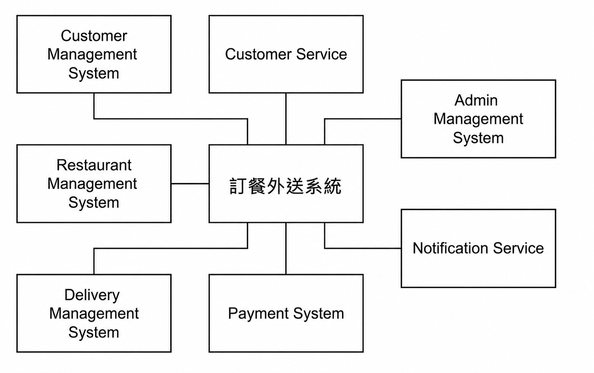

### 2. Activity Diagram -- 下單流程

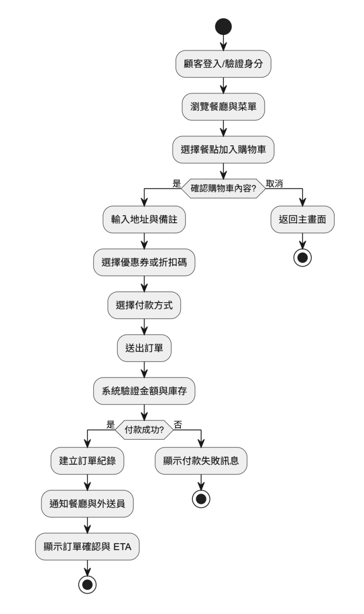

### 3. Swimlane Activity Diagram -- 外送員接單與送餐

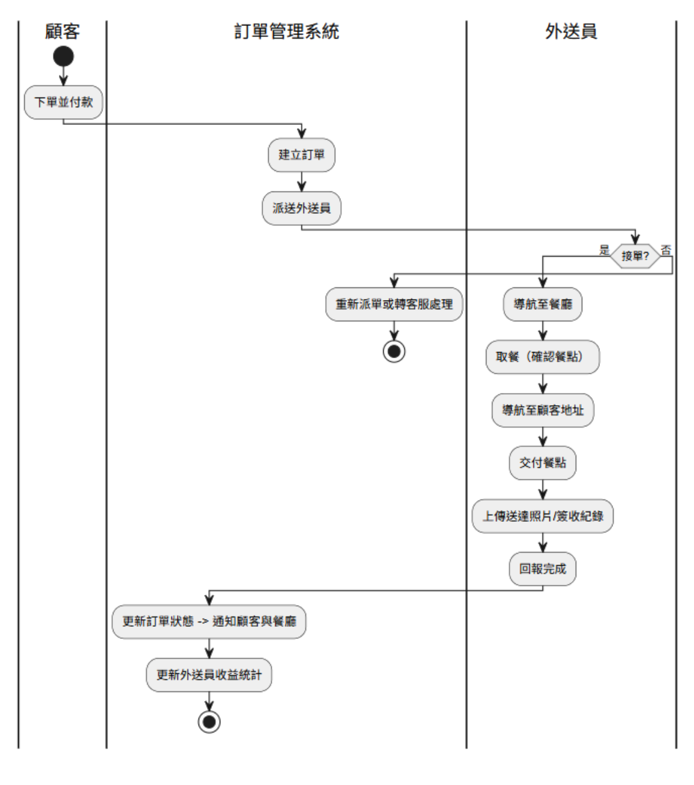

### 4. Use Case Diagram

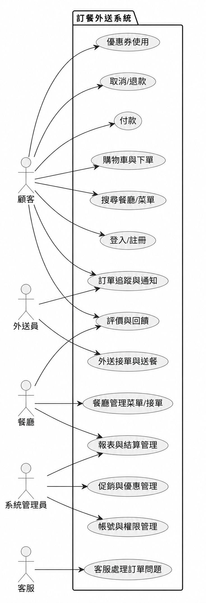

#### I. 顧客 Use Cases

| 編號 | Use Case | 目的／說明 | 介面 |
|---|---|---|---|
| UC-01 | 顧客註冊／登入 | 讓顧客能建立帳號並登入系統，以個人化存取功能與訂單資料。 | App／Web 登入畫面（支援信箱、手機、社群登入） |
| UC-02 | 餐廳瀏覽與搜尋 | 讓顧客可根據地點、類別或評分搜尋附近餐廳，查看詳細資訊與菜單。 | 主頁搜尋列、餐廳列表頁、餐廳詳情頁 |
| UC-03 | 加入購物車 | 讓顧客選擇餐點並暫存於購物車中，以便下單。 | 餐廳菜單頁、購物車頁面 |
| UC-04 | 下單與結帳 | 讓顧客確認購物車內容、配送方式與聯絡資訊後送出訂單。 | 結帳頁、訂單確認頁 |
| UC-05 | 線上付款 | 提供信用卡、行動支付、電子錢包等多元付款方式完成交易。 | 支付頁面（整合第三方金流介面） |
| UC-06 | 訂單追蹤 | 讓顧客能即時查看訂單狀態與外送員位置（含 ETA）。 | 訂單追蹤頁（顯示地圖與狀態列） |
| UC-07 | 訂單管理 | 讓顧客查閱歷史訂單、重新下單或取消尚未出餐的訂單。 | 訂單列表／明細頁 |
| UC-08 | 評價與回饋 | 讓顧客對餐廳及外送員進行星級與文字評論，提供服務改善依據。 | 評價彈窗或訂單完成頁 |
| UC-09 | 優惠券使用 | 讓顧客於結帳時使用優惠碼或折扣券以減免金額。 | 結帳頁之「輸入優惠代碼」區域 |
| UC-10 | 退款申請 | 顧客於訂單問題發生後可申請退款或補償，並與客服聯繫。 | 客服中心／訂單詳情頁之「申請退款」按鈕 |

#### II. 餐廳 Use Cases

| 編號 | Use Case | 目的／說明 | 介面 |
|---|---|---|---|
| UC-11 | 餐廳註冊／登入 | 讓餐廳建立並登入店家帳號，管理菜單與訂單。 | 店家登入頁（Web 後台） |
| UC-12 | 菜單管理 | 餐廳可新增、修改、刪除餐點項目及設定價格、圖片與庫存。 | 店家後台 → 菜單管理頁 |
| UC-13 | 接單與拒單 | 餐廳可接收新訂單通知，選擇接受或拒絕。 | 訂單通知視窗／訂單列表 |
| UC-14 | 更新備餐狀態 | 餐廳可標記訂單為「備餐中」、「已完成」等狀態。 | 訂單詳情頁之狀態切換按鈕 |
| UC-15 | 營收與報表 | 讓餐廳檢視營收統計與訂單數據，支援期間篩選。 | 店家後台 → 報表分析頁 |
| UC-16 | 優惠活動設定 | 餐廳可設定促銷方案、折扣或參與平台活動。 | 店家後台 → 優惠設定頁 |

#### III. 外送員 Use Cases

| 編號 | Use Case | 目的／說明 | 介面 |
|---|---|---|---|
| UC-17 | 外送員登入／上線 | 讓外送員登入系統並設定「上線」狀態以接單。 | 外送員 App 登入頁與首頁開關 |
| UC-18 | 接收派單 | 外送員可即時接收系統派單並選擇接受或拒絕。 | 派單通知彈窗／接單按鈕 |
| UC-19 | 外送導航 | 外送員可使用內建地圖導航至取餐與送達地點。 | 地圖導航頁（整合導航 SDK） |
| UC-20 | 更新外送狀態 | 外送員可更新訂單狀態（取餐完成／配送中／已送達）。 | 訂單詳情頁之狀態按鈕 |
| UC-21 | 上傳送達證明 | 外送完成後上傳照片或顧客簽收紀錄。 | 上傳頁／拍照介面 |
| UC-22 | 收益與統計 | 外送員可查看每日收益、接單量與評價。 | 外送員 App → 個人中心 → 收益頁 |

#### IV. 管理者 Use Cases

| 編號 | Use Case | 目的／說明 | 介面 |
|---|---|---|---|
| UC-23 | 帳號與權限管理 | 管理不同使用者角色（顧客、餐廳、外送員、客服）的存取權限。 | 後台管理系統 → 使用者管理頁 |
| UC-24 | 優惠與促銷管理 | 建立、修改或刪除平台層級的優惠券或活動。 | 後台管理系統 → 優惠管理頁 |
| UC-25 | 金流與退款審核 | 審核顧客退款請求並查閱交易紀錄。 | 客服後台 → 退款審核頁 |
| UC-26 | 系統監控與報表 | 產生營運報表與監控系統健康狀態。 | 後台儀表板（Dashboard） |
| UC-27 | 客服支援與糾紛處理 | 處理顧客投訴、訂單爭議、補償等事宜。 | 客服工單系統介面 |

### 5. Sequence Diagram

#### a. 顧客瀏覽餐廳與搜尋流程

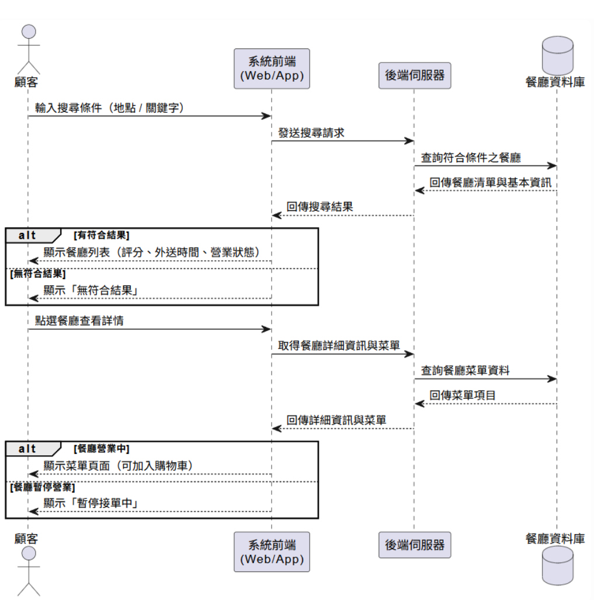

#### b. 顧客下單與付款流程

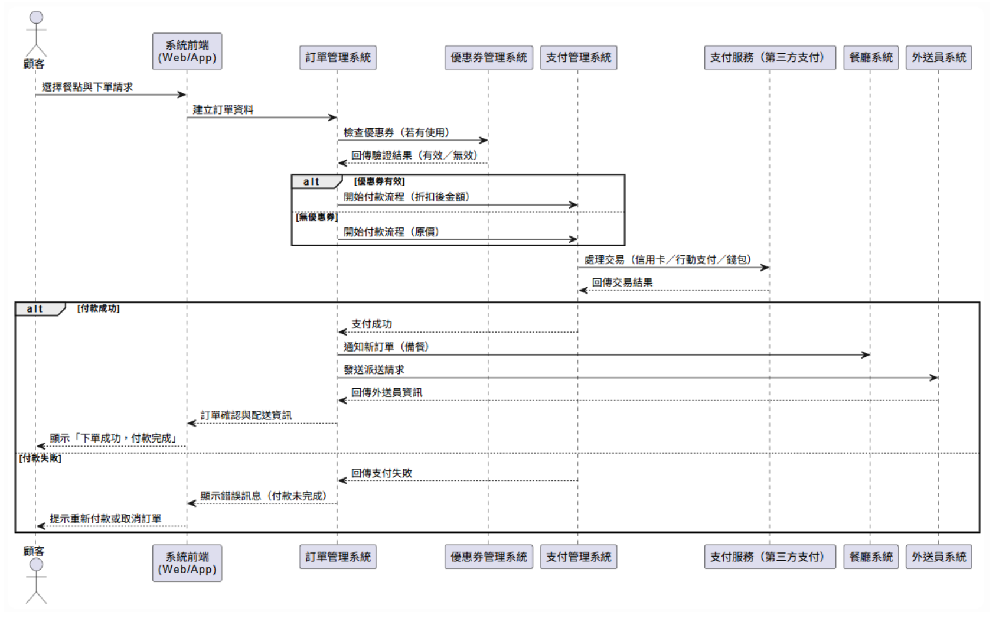

#### c. 餐廳菜單管理

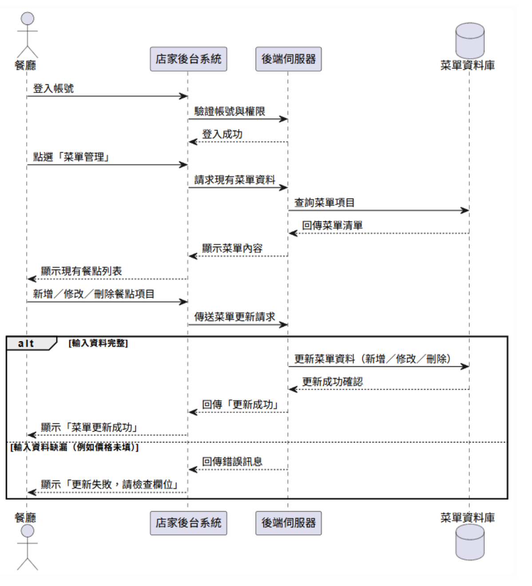

#### d. 餐廳接單與拒單流程

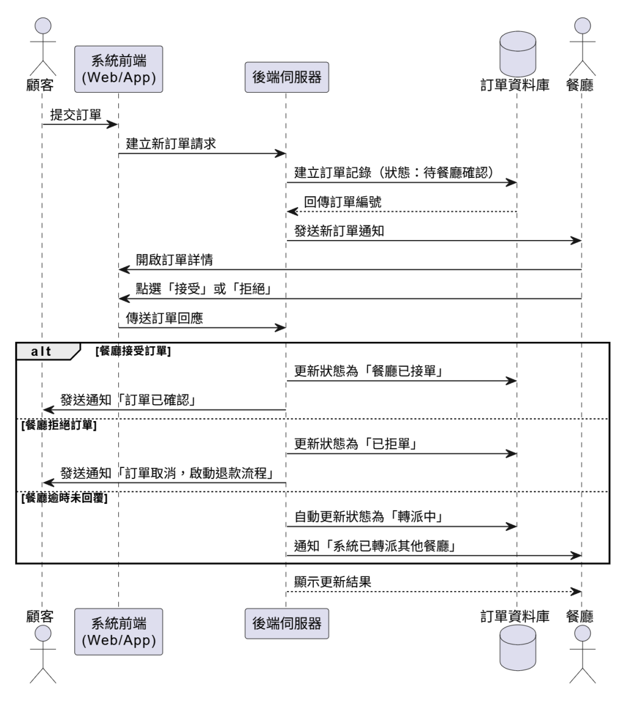

#### e. 外送員接受派單

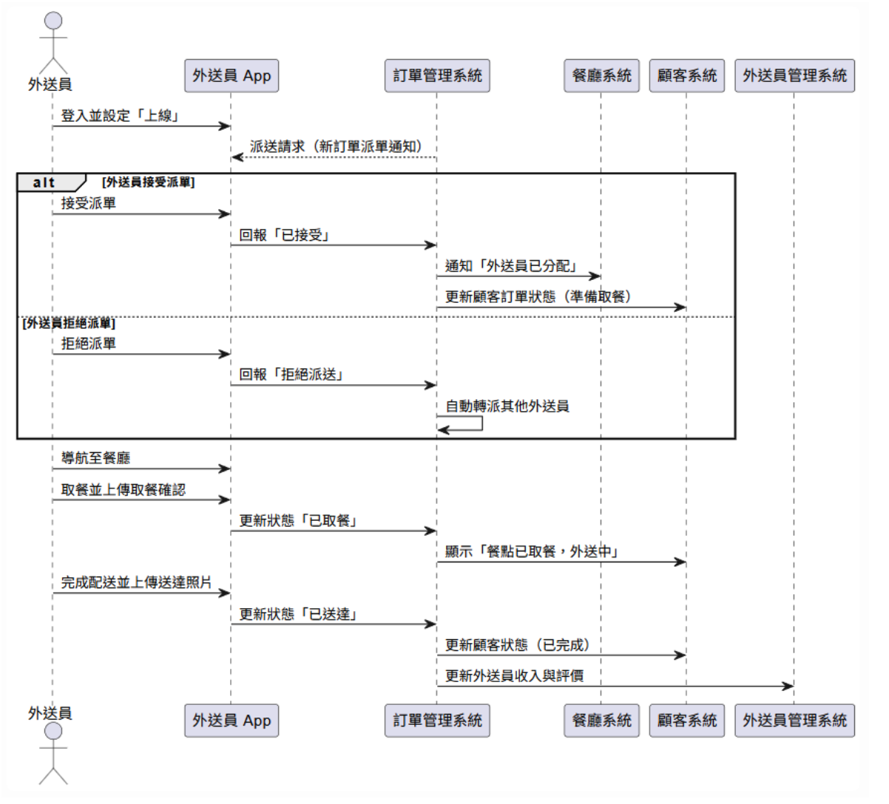

#### f. 客服支援與糾紛處理流程

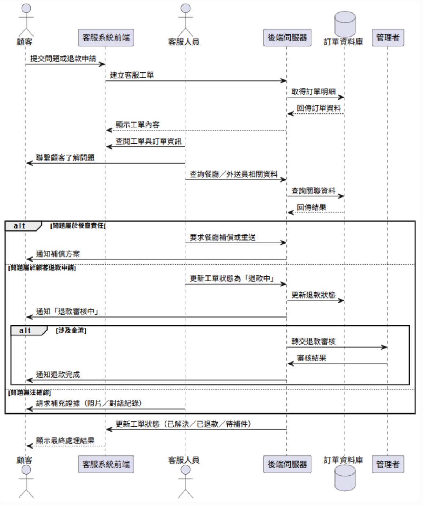

### 6. Class Diagram

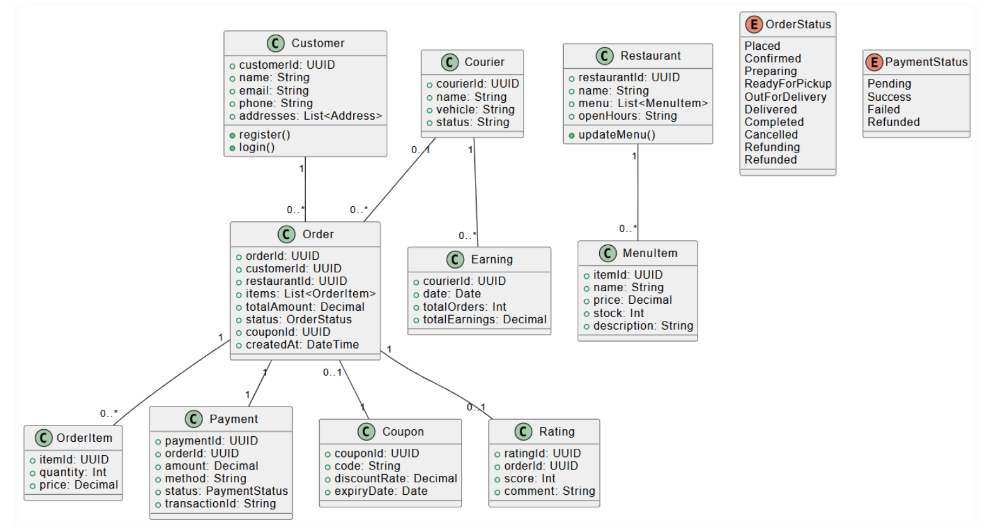

### 7. State Machine

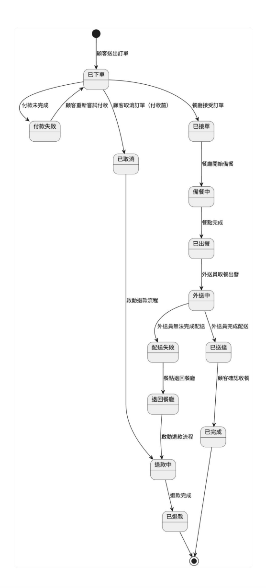
